<h1 align="center">📇 Smart Contact Manager 📇</h1> 

<p align="center">
  
  
  
  
  
  
  
  
  
  
  
</p>
<hr>

<h2> 📜 Purpose</h2>
<p>
  The purpose of the Smart Contact Manager application is to help users store, manage, and organize their contacts securely in one place. Instead of saving contacts in phones, books, or scattered places, this
  application provides a safe, easy-to-use platform where users can:
</p>
<ul>
  <li>Save all their contact information safely</li>
  <li>Quickly search, update, and delete contacts</li>
  <li>Mark important contacts as favorites</li>
  <li>Manage their profile and password securely</li>
</ul>
<p>It ensures users never lose their contacts and can access them easily whenever they need.</p>
<hr>

<h2>🔒 Security Features</h2>
<ul>
  <li>Provides secure login and authentication using Spring Security</li>
  <li>Encrypts user passwords to prevent unauthorized access</li>
  <li>Allows users to reset passwords safely through OTP-based email verification</li>
  <li>Protects all user-specific data so only authenticated users can access their own contacts The Smart Contact Manager is designed to store and organize contacts securely. It allows users to manage personal
    and professional contacts in a structured and safe environment
  </li>
</ul>
<hr>

<h2>🛠️ Tech Stack</h2>
  <p>
    
    <strong>Java</strong> – Core language used for backend development.
  </p>
  <p>
    
    <strong>Spring Boot</strong> – Main framework for building the application.
  </p>
  <p>
    
    <strong>Spring MVC</strong> – Used for handling controllers and UI flow.
  </p>
  <p>
    
    <strong>Spring Data JPA</strong> – Database operations using repositories.
  </p>
  <p>
    
    <strong>Spring Security</strong> – Authentication and authorization.
  </p>
  <p>
    
    <strong>MySQL</strong> – Relational database to store user & contact data.
  </p>
  <p>
    
    <strong>HTML</strong> – Structure of the UI pages.
  </p>
  <p>
    
    <strong>CSS</strong> – Styling for the pages.
  </p>
  <p>
    
    <strong>JavaScript</strong> – Client-side validation and dynamic UI behavior.
  </p>
  <p>
    
    <strong>Bootstrap</strong> – Responsive UI components.
  </p>
  <p>
    
    <strong>Apache Tomcat</strong> – Server to run the web application.
  </p>
  <p>
    
    <strong>Maven</strong> – Build and dependency management tool.
  </p>

<hr>

<h2>📁 Project Architecture</h2>
<p>This project follows a clean 5-layer architecture for scalability and maintainability.</p>
<ul>
  <li><b>Controller Layer:</b> Handles HTTP requests and responses.</li>
  <li><b>Service Layer:</b> Contains business logic.</li>
  <li><b>Repository Layer:</b> Performs database operations.</li>
  <li><b>Model Layer:</b> Entity classes and ORM mappings.</li>
  <li><b>Config Layer:</b> Spring Security, application-level configurations.</li>
</ul>
<hr>

<h2>🏗️ Folder Structure</h2> 

```
smart-contact-manager/
├── src/
│   ├── main/
│   │   ├── java/
│   │   │   └── com/example/contactmanager/
│   │   │       ├── controller/
│   │   │       ├── model/
│   │   │       ├── repository/
│   │   │       ├── service/
│   │   │       └── config/
│   │   └── resources/
│   │       ├── static/
│   │       ├── templates/
│   │       └── application.properties
├── pom.xml
└── README.md
```
<hr>

<h2>✨ Features</h2>

<h3>🔑 User Authentication</h3>
<ul>
  <li><strong>Registration:</strong> Allows new users to sign up and their passwords are stored securely.</li>
  <li><strong>Login:</strong> Users can sign in using Spring Security authentication.</li>
  <li><strong>Forgot Password:</strong> Users can reset the password using an OTP sent to their registered email.</li>
</ul>

<h3>📂 Contact Management</h3>
<ul>
  <li><strong>Add Contact:</strong> Users can add new contact details.</li>
  <li><strong>View Contacts:</strong> Shows all contacts for the logged-in user.</li>
  <li><strong>View Single Contact:</strong> Displays full details of one selected contact.</li>
  <li><strong>Update Contact:</strong> Allows editing the details of an existing contact.</li>
  <li><strong>Remove Contact:</strong> Permanently delete a contact.</li>
  <li><strong>Mark as Favorite:</strong> Add important contacts to a favorites list.</li>
  <li><strong>View Favorites:</strong> Shows all contacts marked as favorite.</li>
  <li><strong>Delete Favorites:</strong> Remove a contact from favorites.</li>
</ul>

<h3>👤 User Profile Management</h3>
<ul>
  <li><strong>View Profile:</strong> Users can see their profile information.</li>
  <li><strong>Update Profile:</strong> Allows users to update their personal details.</li>
  <li><strong>Delete Account:</strong> Users can permanently delete their account.</li>
  <li><strong>Change Password:</strong> Users can update their account password.</li>
</ul>

<hr>


## 📋 How to Run the Project

### Prerequisites

Make sure you have installed:

* JDK 8 or above
* Spring Tool Suite
* MySQL Server
* Maven

### Steps

1. **Clone the repository:**

```bash
git clone https://github.com/your-username/smart-contact-manager.git
```

2. **Navigate to project directory:**

```bash
cd smart-contact-manager
```

3. **Configure MySQL:**

   * Open `application.properties`
   * Update database username, password, and schema

4. **Build the project:**

```bash
mvn clean install
```

5. **Run the application:**

```bash
mvn spring-boot:run
```

6. **Open browser:**

```
http://localhost:8000
```

<hr>

## 📸 Screenshots

### 1. Index


### 2. Registration

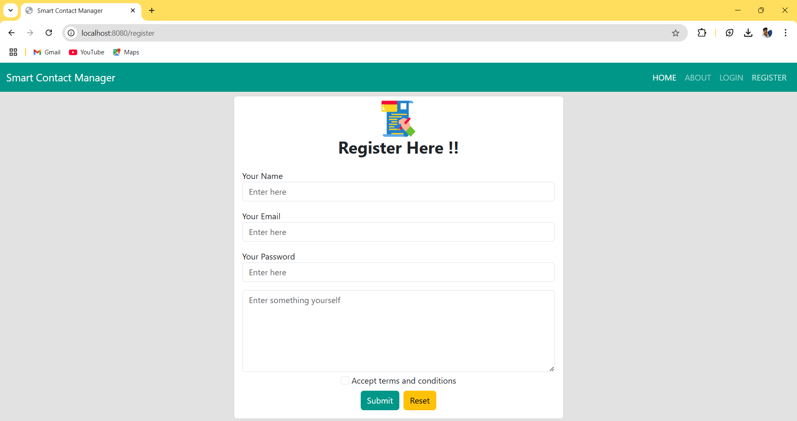

### 3. Login

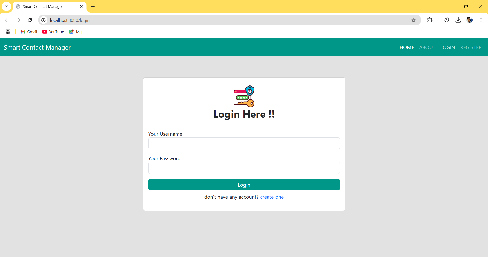

### 4. About

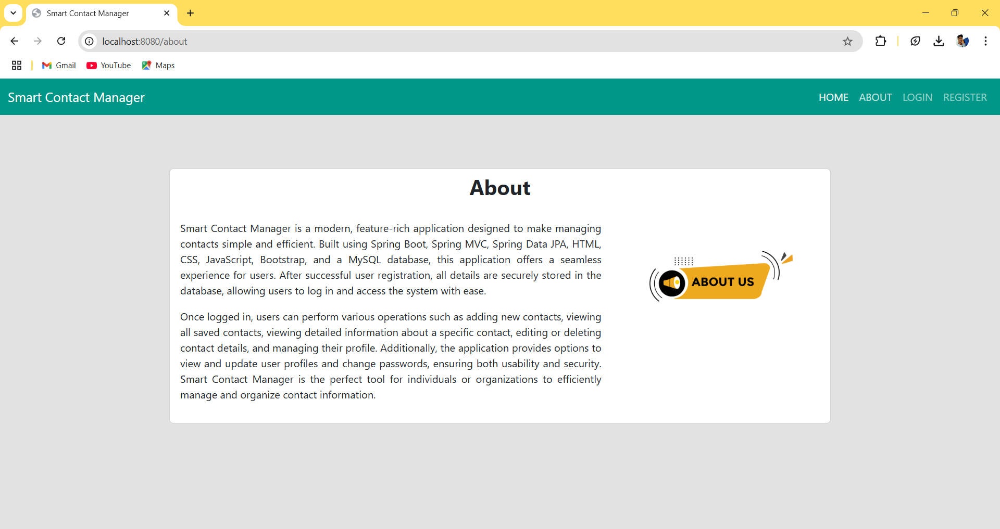

### 5. User Home

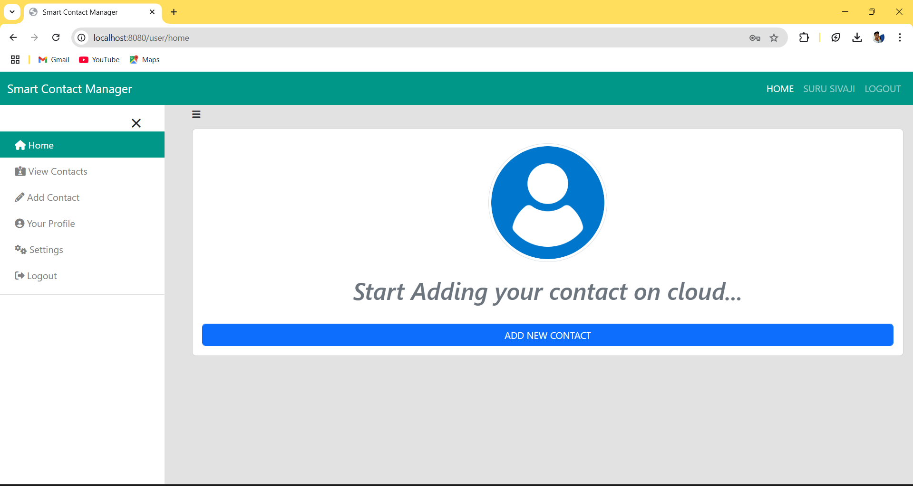

### 6. Add Contact

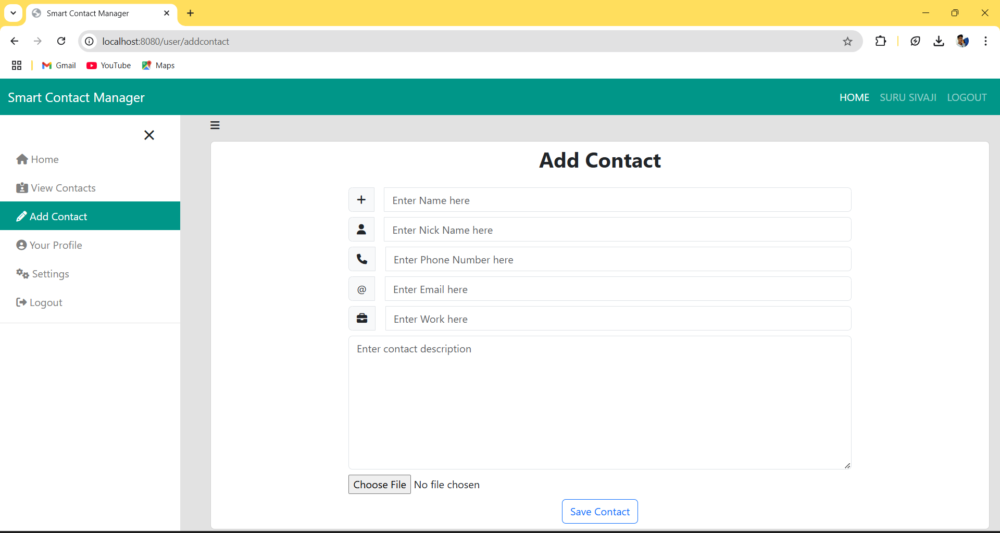

### 7. View Contact

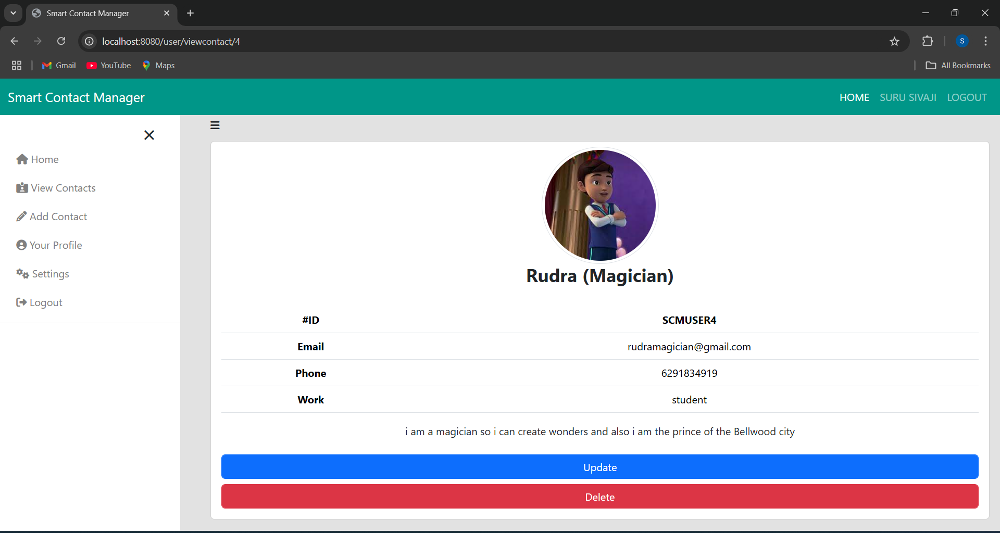

### 8. All Contacts

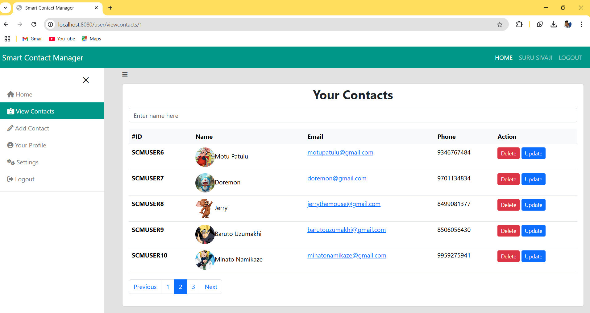

### 9. Edit Contact

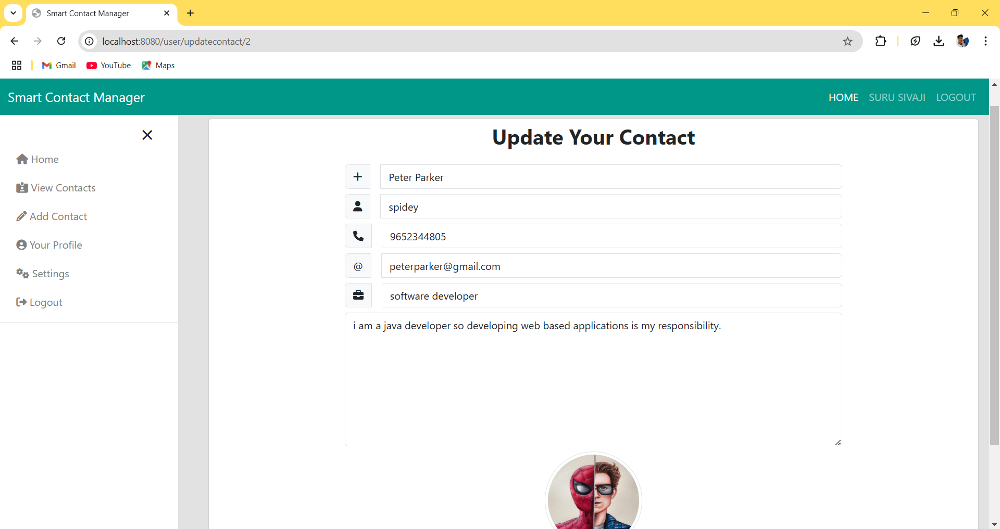

### 10. Delete Contact

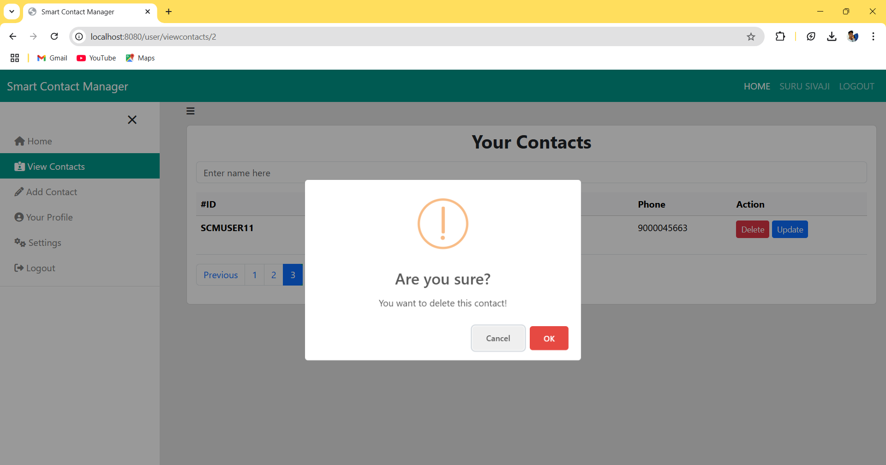

### 11. Profile

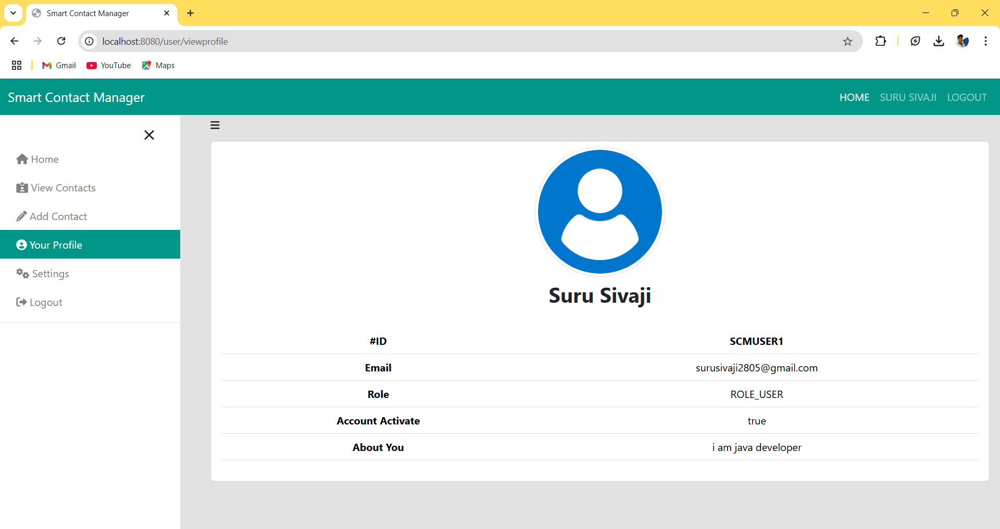

### 12. Settings

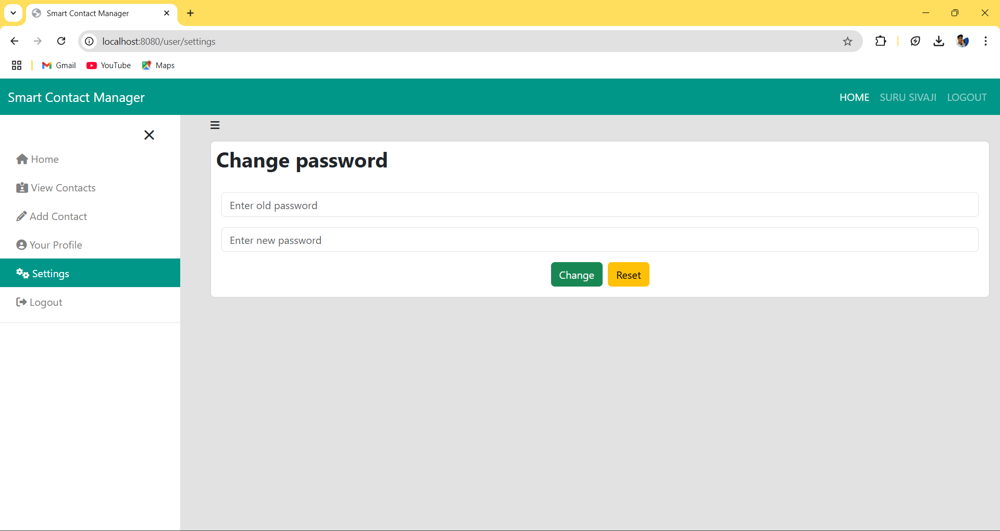

### 13. Logout

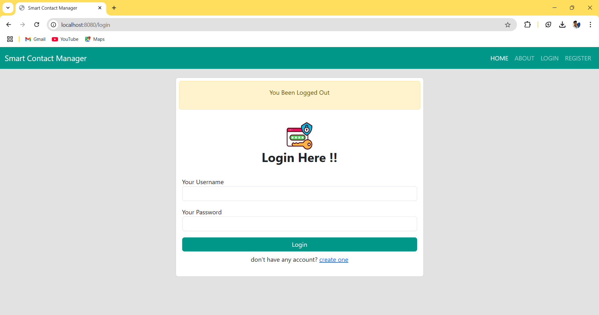

<hr>


<h3 align="center">🎉 Enjoy using Smart Contact Manager! 🎉</h3>
