<h1 align="center">📇 Smart Contact Manager</h1>

  A user-friendly application developed using <b>Spring Boot</b>, <b>Spring Data JPA</b>, <b>Spring MVC</b>, <b>HTML</b>, <b>CSS</b>, <b>JavaScript</b>, <b>Bootstrap</b>, <b>jQuery</b>, and <b>MySQL</b>.

<h2>📜 Overview</h2>

  The <strong>Smart Contact Manager</strong> is designed to simplify the management of personal and professional contacts. 
  With the growing need for secure and structured storage of contact information, this project ensures users can efficiently organize their contacts, maintain security, 
  and access them whenever required. It combines powerful backend technology with an intuitive frontend, making it suitable for both personal and business purposes. 
  This application eliminates the risks of losing contacts stored in physical or decentralized mediums while providing advanced features like search, updates, and user-specific dashboards.

<h2>✨ Features</h2>

<h3>🔑 User Authentication</h3>
<ul>
  <li><strong>Registration:</strong> Secure user registration with encrypted storage of user credentials.</li>
  <li><strong>Login:</strong> User authentication to access application features.</li>
</ul>

<h3>📂 Contact Management</h3>
<ul>
  <li><strong>Add Contact:</strong> Create and store new contact information.</li>
  <li><strong>View Contacts:</strong> View all saved contacts in a structured format.</li>
  <li><strong>View Specific Contact:</strong> Search and view detailed information for a specific contact.</li>
  <li><strong>Update Contact:</strong> Modify the details of an existing contact.</li>
  <li><strong>Remove Contact:</strong> Delete a contact from the database.</li>
</ul>

<h3>👤 User Profile Management</h3>
<ul>
  <li><strong>View Profile:</strong> View user details and account information.</li>
  <li><strong>Change Password:</strong> Securely update the user's password.</li>
</ul>

<h2>🛠️ Technologies Used</h2>
<ul>
  <li><strong>Backend:</strong> Spring Boot, Spring Data JPA, Spring MVC</li>
  <li><strong>Frontend:</strong> HTML, CSS, JavaScript, jQuery, Bootstrap</li>
  <li><strong>Database:</strong> MySQL</li>
</ul>

<h2>📋 How to Run the Project</h2>

<h3>Prerequisites</h3>

Ensure you have the following installed:

<ul>
  <li>Java Development Kit (JDK 8 or above)</li>
  <li>MySQL Server</li>
  <li>Maven</li>
</ul>

<h3>Steps</h3>
<ol>
  <li>Clone the repository:
    <pre><code>git clone https://github.com/your-username/smart-contact-manager.git</code></pre>
  </li>
  <li>Navigate to the project directory:
    <pre><code>cd smart-contact-manager</code></pre>
  </li>
  <li>Configure the MySQL database:
    <ul>
      <li>Update the <code>application.properties</code> file with your database credentials.</li>
    </ul>
  </li>
  <li>Build the project:
    <pre><code>mvn clean install</code></pre>
  </li>
  <li>Run the application:
    <pre><code>mvn spring-boot:run</code></pre>
  </li>
  <li>Access the application in your browser:
    <pre><code>http://localhost:8080</code></pre>
  </li>
</ol>

<h2>📸 Screenshots</h2>

Below are sample screenshots showcasing the Smart Contact Manager Application:

<h4>1. Index</h4>
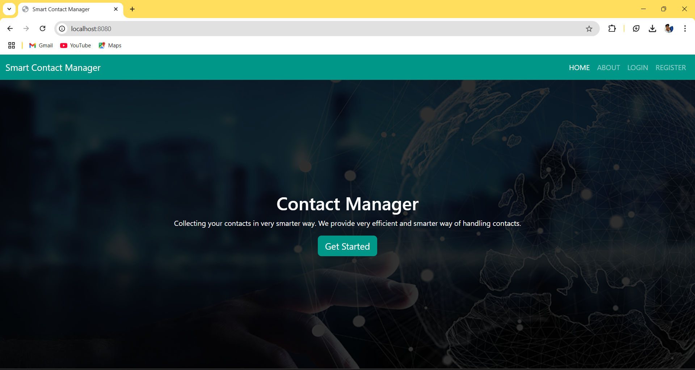

<h4>2. Registration</h4>
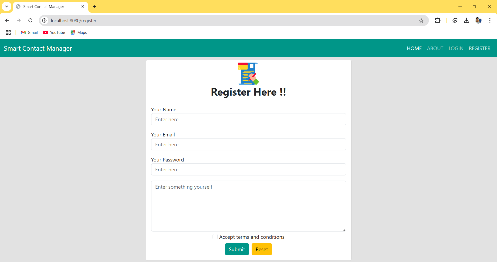

<h4>3. Login</h4>
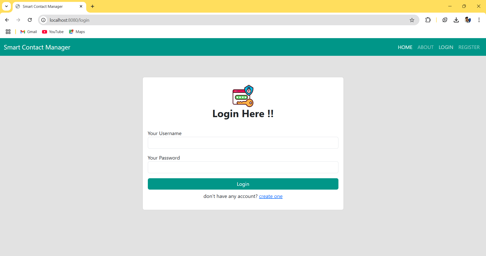

<h4>4. About</h4>
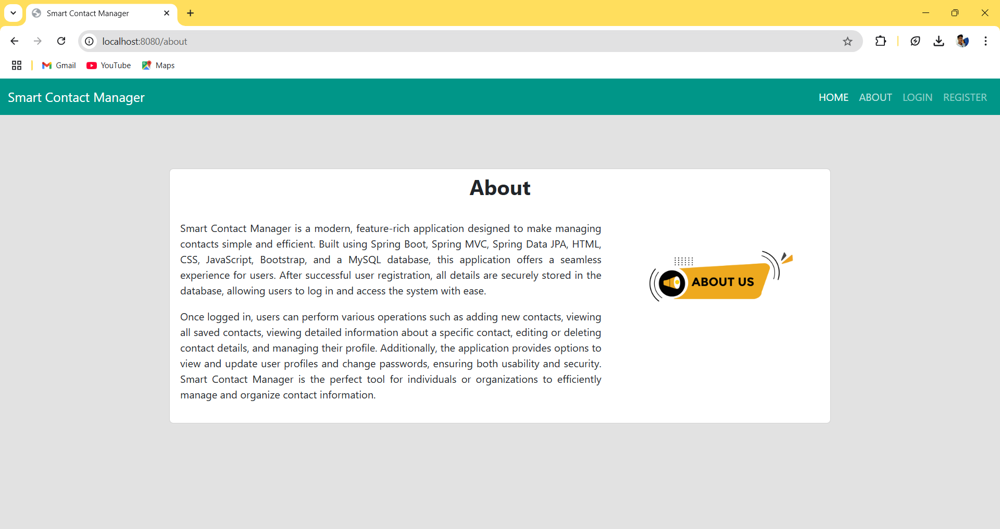

<h4>5. Home</h4>
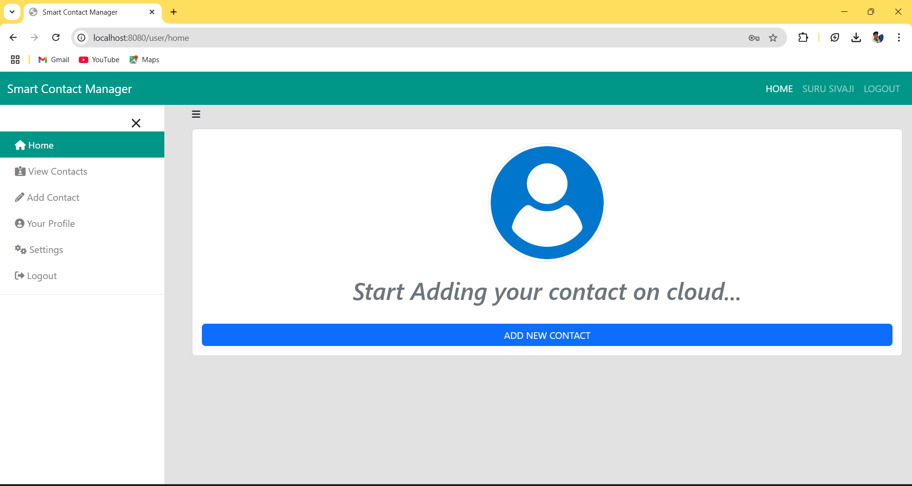

<h4>6. Add Contact</h4>
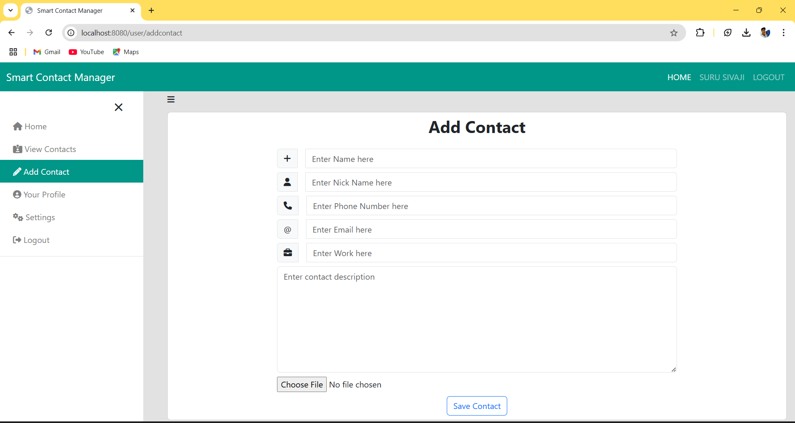

<h4>7. View Contact</h4>
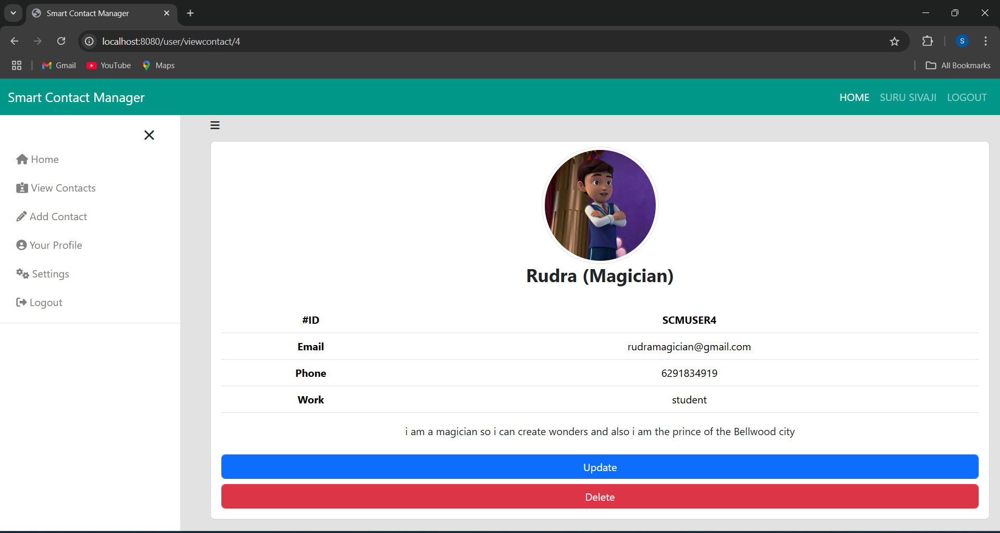

<h4>8. View All Contacts</h4>
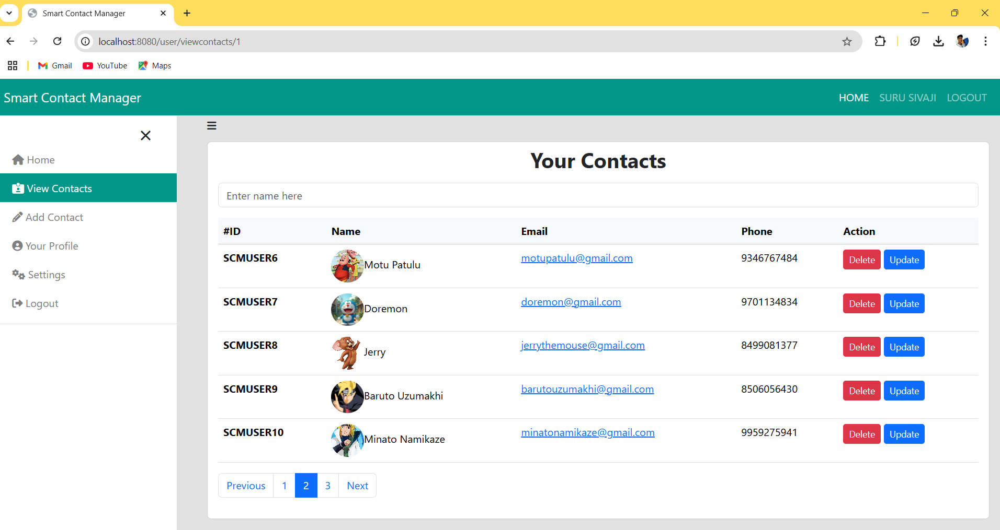

<h4>9. Edit Contact</h4>
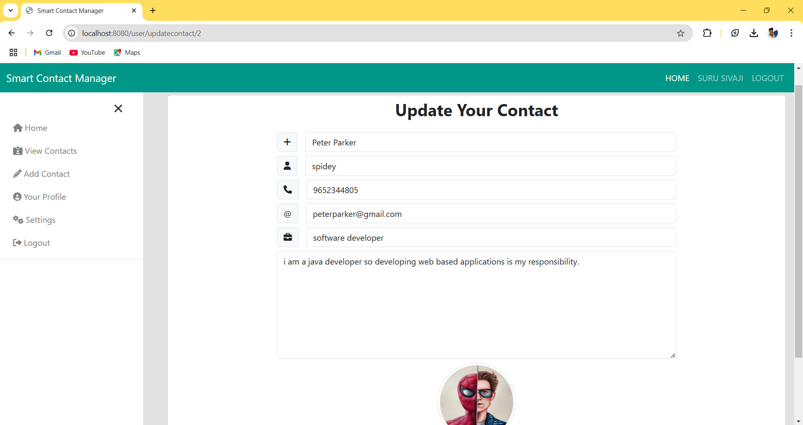

<h4>10. Delete Contact</h4>
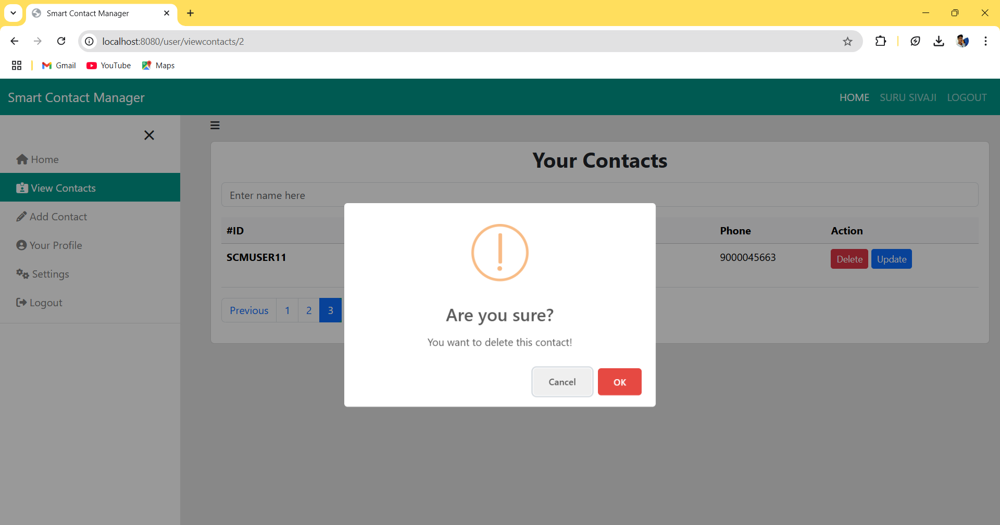

<h4>11. Profile</h4>
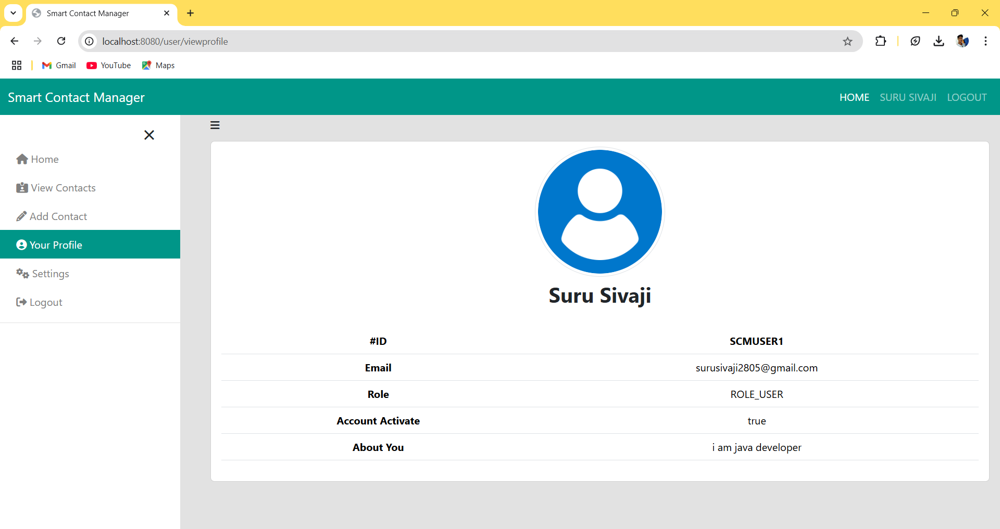

<h4>12. Settings</h4>
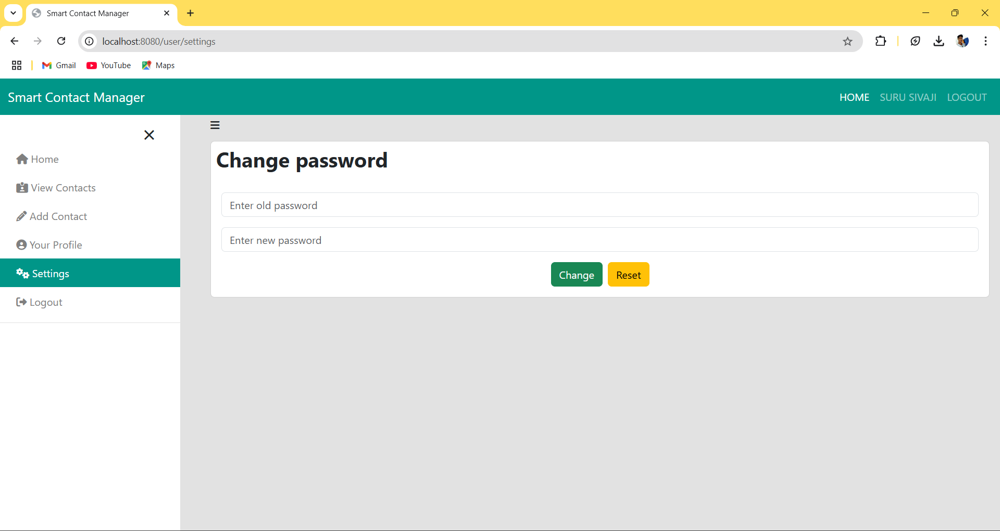

<h4>13. Logout</h4>
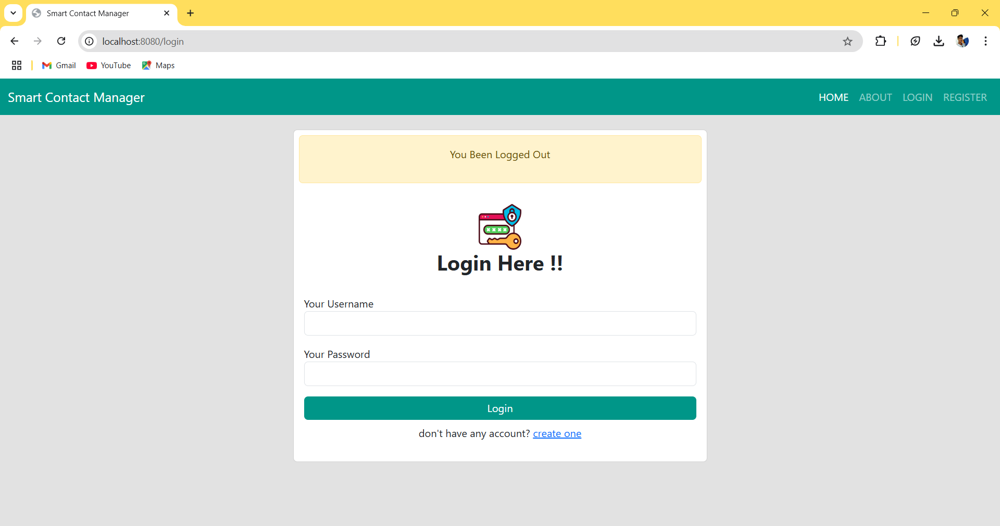

<h2>🏗️ Folder Structure</h2>
<pre>
smart-contact-manager/
├── src/
│   ├── main/
│   │   ├── java/
│   │   │   └── com/example/contactmanager/
│   │   │       ├── controller/
│   │   │       ├── model/
│   │   │       ├── repository/
│   │   │       └── service/
│   │   └── resources/
│   │       ├── static/
│   │       ├── templates/
│   │       └── application.properties
├── pom.xml
└── README.md
</pre>

<h2>🚀 How It Works</h2>

The Smart Contact Manager simplifies contact management with the following workflow:

<ol>
  <li><strong>Register:</strong> New users register by providing their details, which are securely stored in the database.</li>
  <li><strong>Login:</strong> Users log in to access their personalized dashboard.</li>
  <li><strong>Manage Contacts:</strong>
    <ul>
      <li>Add new contacts with essential details.</li>
      <li>View all contacts or search for specific ones.</li>
      <li>Edit or delete existing contact information.</li>
    </ul>
  </li>
  <li><strong>Profile Management:</strong>
    <ul>
      <li>View and update personal profile details.</li>
      <li>Change password for enhanced security.</li>
    </ul>
  </li>
</ol>

<h3 align="center">🎉 Enjoy using Smart Contact Manager! 🎉</h3>
